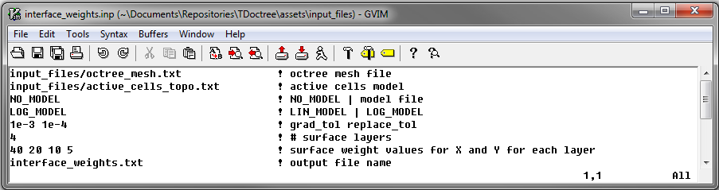

.. _example_weights:

Forward Modeling
================

Here, the code **interface_weights.exe** and the input file **interface_weights.inp** are used to create basic interface weights for the inversion. Files relevant to this part of the example are in the sub-folder *create_weights*. For this example, we use the mesh that was created in the example ":ref:`create mesh<example_octree>`". Before running this example, you may want to do the following:

	- `Download and open the zip folder containing the entire E3D version 1 example <https://github.com/ubcgif/E3D/raw/master/assets/e3d_ver1_example.zip>`__ (if not done already)
	- :ref:`Learn how to run code from command line <e3d_weights>`
	- :ref:`Learn the format of the input file <e3d_input_weights>`

To generate the weights, the following input file was used:

