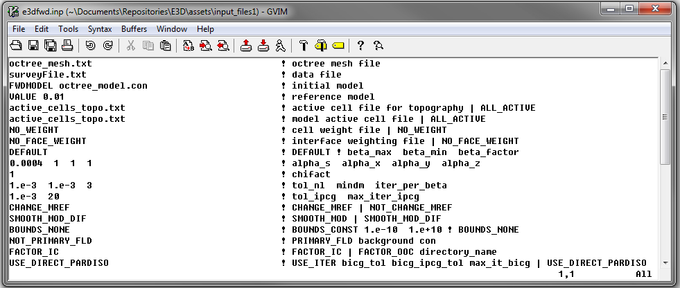
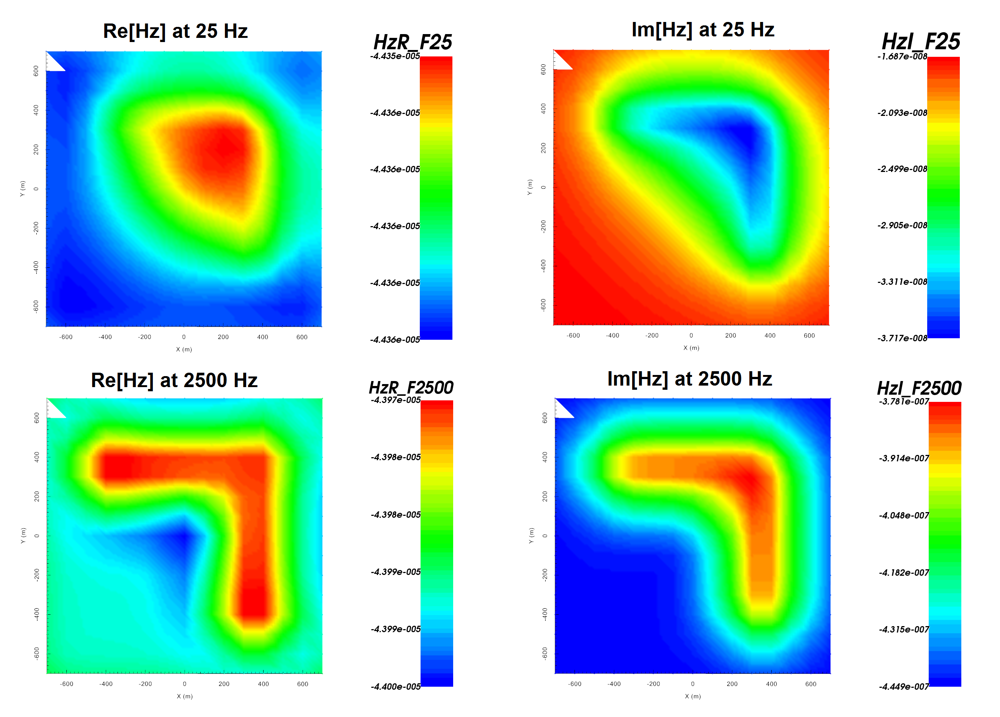

.. _example_fwd:

Forward Modeling
================

Here, the code **e3dinv.exe** and the input file **e3dfwd.inp** (:ref:`see format <e3d_input_fwd>`) are used to forward model FEM data for a synthetic airborne survey. The transmitter loop is horizontal and flown 125 m above the survey. The receiver is located 50 m below. Files relevant to this part of the example are in the sub-folder *fwd*. For this example, we use the model that was created in the example ":ref:`create model<example_model>`". Before running this example, you may want to do the following:

	- `Download and open the zip folder containing the entire E3D version 1 example <https://github.com/ubcgif/E3D/raw/master/assets/e3d_ver1_example.zip>`__ (if not done already)
	- :ref:`Learn how to run code from command line <e3d_fwd>`
	- :ref:`Learn the format of the input file <e3d_input_fwd>`

To forward model the data, the following input file was used:

E3D version 1 forward models the Cartesian components of the electric field and total magnetic field. Below we show the real and imaginary components of the vertical magnetic field at 25 Hz and 2500 Hz.

