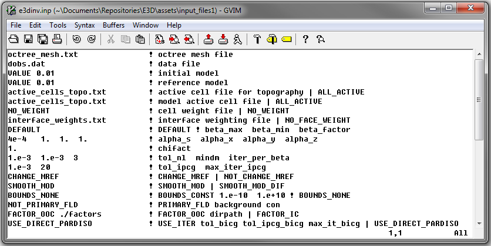
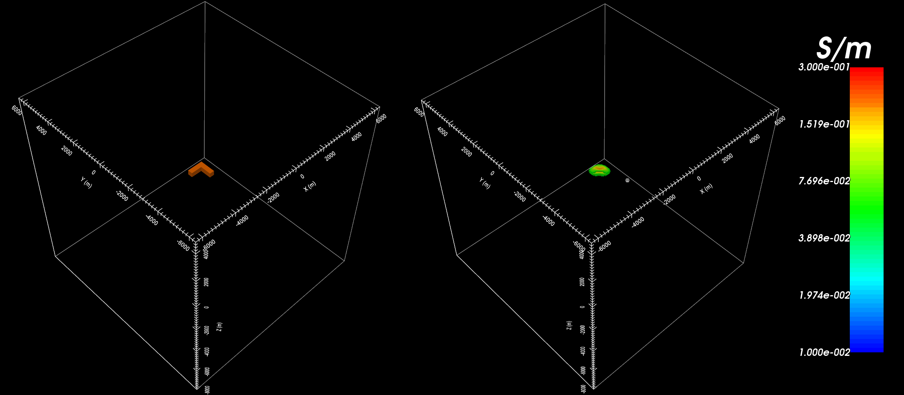

.. _example_inv:

Inversion
=========

Here, the code **e3dinv.exe** and the input file **e3dinv.inp** (:ref:`see format <e3d_input_inv>`) are used to invert Hz data. FEM data were created in the example ":ref:`forward modeling<example_fwd>`". Basic uncertainties were added for the sake of keeping the example simple. In practice, data are noisy and choosing appropriate uncertainties is very important for successful inversion. Files relevant to this part of the example are in the sub-folder *inv*. Before running this example, you may want to do the following:

	- `Download and open the zip folder containing the entire E3D version 1 example <https://github.com/ubcgif/E3D/raw/e3dinv/assets/e3d_ver1_example.zip>`__ (if not done already)
	- :ref:`Learn how to run code from command line <e3d_inv>`
	- :ref:`Learn the format of the input file <e3d_input_inv>`

To invert the synthetic data, the input file below was used:

The true model (left) and recovered model (right) at iteration 3 are shown below. A cutoff of 0.05 S/m has been used for both models. We should note some things about the inversion:

	- We inverted data at only two frequencies (25 Hz and 2500 Hz)
	- We only inverted the vertical component of the total magnetic field
	- Only simple uncertainties were applied

The inversion places a conductive body in the appropriate location and is able to resolve the surface of the conductor. Given the minimal number of frequencies and field components being inverted in the example, the data were still able to resolve the shape of the conductor to a reasonable degree. For this case however, the inversion does not locate the bottom of the conductor.

