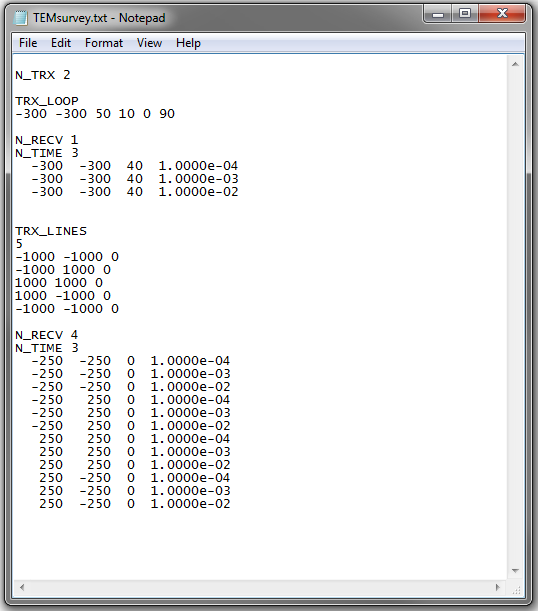

.. _obsFile:

Observations File
=================

The observations contains the set of field measurements used in the inversion. This file contains all necessary survey information including: the number of transmitters, transmitter geometry, observation locations, time channels, observed fields and uncertainties. 

.. note:: Bolded entries are fixed flags recognized by the Fortran codes and blue hyperlinked entries are values/regular expressions specified by the user

The lines the observations file are formatted as follows:

| **IGNORE** :ref:`reg_exp<tdoctree_dobs_ln1b>`
|
| **N_TRX** :math:`\;` :ref:`n_trx<tdoctree_dobs_ln1>`
|
|
| :ref:`trx type<tdoctree_dobs_ln2>`
| :ref:`n_nodes<tdoctree_dobs_ln3>`
| :math:`\;\;` :ref:`x1 y1 z1<tdoctree_dobs_ln4>`
| :math:`\;\;` :ref:`x2 y2 z2<tdoctree_dobs_ln4>`
| :math:`\;\;\;\;\;\;\;\; \vdots`
| :math:`\;\;` :ref:`xn yn zn<tdoctree_dobs_ln4>`
| :math:`\;\;` :ref:`x1 y1 z1<tdoctree_dobs_ln4>`
| 
| **FREQUENCY** :math:`\;` :ref:`f1<tdoctree_dobs_ln5>`
| **N_RECV** :math:`\;` :ref:`n_recv<tdoctree_dobs_ln6>`
| :math:`\;\;` :ref:`Data Array<tdoctree_dobs_ln7>`
|
|
| :ref:`trx type<tdoctree_dobs_ln2>`
| :ref:`n_nodes<tdoctree_dobs_ln3>`
| :math:`\;\;` :ref:`x1 y1 z1<tdoctree_dobs_ln4>`
| :math:`\;\;` :ref:`x2 y2 z2<tdoctree_dobs_ln4>`
| :math:`\;\;\;\;\;\;\;\; \vdots`
| :math:`\;\;` :ref:`xn yn zn<tdoctree_dobs_ln4>`
| :math:`\;\;` :ref:`x1 y1 z1<tdoctree_dobs_ln4>`
|
| **FREQUENCY** :math:`\;` :ref:`f2<tdoctree_dobs_ln5>`
| **N_RECV** :math:`\;` :ref:`n_recv<tdoctree_dobs_ln6>`
| :math:`\;\;` :ref:`Data Array<tdoctree_dobs_ln7>`
|
|
| :math:`\;\;\;\;\;\; \vdots`
|
|
| :ref:`trx type<tdoctree_dobs_ln2>`
| :ref:`n_nodes<tdoctree_dobs_ln3>`
| :math:`\;\;` :ref:`x1 y1 z1<tdoctree_dobs_ln4>`
| :math:`\;\;` :ref:`x2 y2 z2<tdoctree_dobs_ln4>`
| :math:`\;\;\;\;\;\;\;\; \vdots`
| :math:`\;\;` :ref:`xn yn zn<tdoctree_dobs_ln4>`
| :math:`\;\;` :ref:`x1 y1 z1<tdoctree_dobs_ln4>`
|
| **FREQUENCY** :math:`\;` :ref:`fn<tdoctree_dobs_ln5>`
| **N_RECV** :math:`\;` :ref:`n_recv<tdoctree_dobs_ln6>`
| :math:`\;\;` :ref:`Data Array<tdoctree_dobs_ln7>`
|
| *Repeat for number of unique transmitter-frequency pairs*
|
|

     Example locations file for MTZ data.

Parameter Descriptions
----------------------

.. _tdoctree_dobs_ln0:

    - **ignore_flag:** Set the regular expression for data that are to be ignored during the inversion

.. _tdoctree_dobs_ln1:

    - **n_trx:** The total number of transmitters. Example: *N_TRX 3*

.. _tdoctree_dobs_ln1b:

    - **reg_exp:** Regular expression (flag) used to data points that are ignored during the inversion

.. _tdoctree_dobs_ln2:

    - **trx type:** For some codes, various transmitter types can be used. For E3D, the transmitter type will always be defined using the flag *TRX_ORIG*. This type of transmitter is a closed inductive loop source.

.. _tdoctree_dobs_ln3:

    - **n_nodes:** The number of nodes defining a particular transmitter loop. Note that:

.. _tdoctree_dobs_ln4:

    - **xi yi zi:** This refers to the X (Easting), Y (Northing) and Z (elevation) locations of the nodes defining the transmitter loop. Transmitters are defined using a left-handed coordinate system. Which means you must define a horizontal transmitter loop in the clockwise direction for a dipole moment in the vertical direction.

.. _tdoctree_dobs_ln5:

    - **fi:** The frequency (in Hz) at which the subsequent set of measurements are made.

.. _tdoctree_dobs_ln6:

    - **n_recv:** The number of receivers collecting field observations at a particular frequency for a particular transmitter.

.. _tdoctree_dobs_ln7:

    - **Data Array:** Contains the X (Easting), Y (Northing) and Z (elevation) locations, observations and uncertainties at a particular frequency for a particular transmitter. It has dimensions :ref:`n_recv<tdoctree_dobs_ln6>` :math:`\times` 27.

Data Array
----------

.. important:: The data are represented in a left-handed coordinate system where X is Easting, Y is Northing and Z is +ve downward. 

For each transmitter at each frequency, a set of field observations are made for a set of receivers. These field observations include real and imaginary components of the electric and magnetic fields as well as their uncertainties. The rows of the data array are formatted as follows:

.. math::
    | \; x \; | \; y \; | \; z \; | \;\;\; E_x \; data \;\;\; | \;\;\; E_y \; data \;\;\; | \;\;\; E_z \; data \;\;\; | \;\;\; H_x \; data \;\;\; | \;\;\; H_y \; data \;\;\; | \;\;\; H_z \; data \;\;\; |

such that :math:`E_x \; data` is comprised of 4 columns:

.. math::

    | \; E_x^\prime \; | \; U_x^\prime \; | \; E_x^{\prime \prime} \; | \; U_x^{\prime \prime} \; |

where

    - :math:`E_x^\prime` is the real component of the electric field along the Easting direction
    - :math:`E_x^{\prime\prime}` is the imaginary component of the electric field along the Easting direction
    - :math:`U_x^\prime` is the uncertainty on :math:`E_x^\prime`
    - :math:`U_x^{\prime\prime}` is the uncertainty on :math:`E_x^{\prime\prime}`

This is done likewise for :math:`E_y`, :math:`E_z`, :math:`H_x`, :math:`E_y`, :math:`H_z`.

