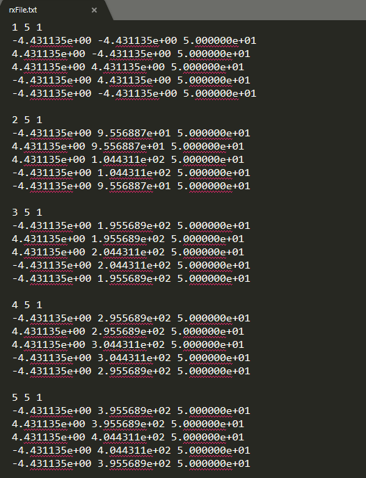

.. _receiverFile:

Transmitter and Receiver Files
==============================

The exact dimensions of the transmitters or receivers used to model FEM data are defined within a transmitter or a receiver file, respectively; i.e. transmitters are defined within a transmitter file and receivers are defined within a receivers file. Because transmitters and receivers are both defined as wire segments, the format of the transmitter and receiver files is identical.

.. note::
    - Bolded entries are fixed flags recognized by the Fortran codes and blue hyperlinked entries are values/regular expressions specified by the user

Format
------

The lines of a transmitter/receiver file are formatted as follows:

|
| :ref:`ID<tdoctree_rec_ln1>` :math:`\;` :ref:`N<tdoctree_rec_ln2>` :math:`\;` :ref:`1<tdoctree_rec_ln3>`
| :math:`\;\;\; x_1 \; y_1 \; z_1`
| :math:`\;\;\;\;\;\;\;\; \vdots`
| :math:`\;\; x_N \; y_N \; z_N`
| :ref:`ID<tdoctree_rec_ln1>` :math:`\;` :ref:`N<tdoctree_rec_ln2>` :math:`\;` :ref:`1<tdoctree_rec_ln3>`
| :math:`\;\;\; x_1 \; y_1 \; z_1`
| :math:`\;\;\;\;\;\;\;\; \vdots`
| :math:`\;\; x_N \; y_N \; z_N`
| :ref:`ID<tdoctree_rec_ln1>` :math:`\;` :ref:`N<tdoctree_rec_ln2>` :math:`\;` :ref:`1<tdoctree_rec_ln3>`
| :math:`\;\;\; x_1 \; y_1 \; z_1`
| :math:`\;\;\;\;\;\;\;\; \vdots`
| :math:`\;\; x_N \; y_N \; z_N`
|
|

Below is an example of a transmitters or receivers file where the respective items are closed horizontal loops.

Parameter Descriptions
----------------------

.. _tdoctree_rec_ln1:

    - **ID:** A unique index number for the transmitter or receiver. The index numbers should be increasing.

.. _tdoctree_rec_ln2:

    - **N:** The number of points defining the transmitter/receiver.

.. _tdoctree_rec_ln3:

    - **1:** As of May 2018, a flag value of 1 is entered here. In future iterations of the code, this entry may be related to additional functionality.
        
.. _tdoctree_rec_ln4:

    - :math:`\mathbf{x_i \;\; y_i \;\; z_i}`: Denotes the X (Easting), Y (Northing) and Z (elevation) locations for nodes defining transmitter/receiver.

    	- **Loop transmitter/receiver:** When defining a loop transmitter or receiver, you **must** close the loop; e.g. the fist and last nodes must be at the same locations. The transmitters and receivers are defined in a **left-handed (clockwise) manner**. For example, a horizontal loop must be defined in a clockwise manner for its dipole moment to be in the vertical direction. Magnetic field measurements are in units A/m and the time-derivative is units T/s.
        
        - **Wire transmitter/receiver:** If the first and last nodes are not in the same place, the user will define a grounded receiver which measures the electric field. The grounded loop can be more than one segment long. In this case, the corresponding data are the electric field in units V/m.

