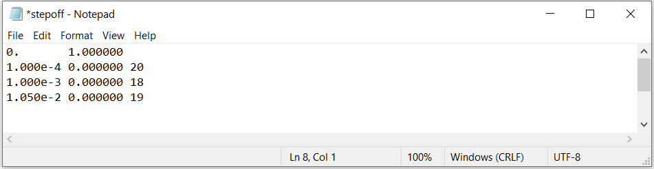
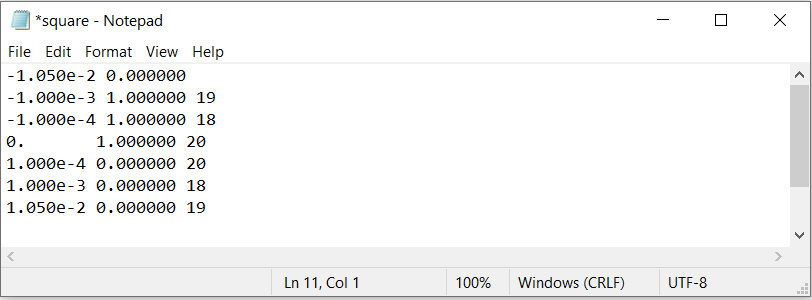

.. _waveFile:

Wave File
=========

The wave file defines the time-stepping that is used to solve the problem and the time-dependent current in the transmitter. The format for the wave file is as follows: 

|
|
:math:`t_0 \;\;\; I_0`
:math:`t_1 \;\;\; I_1 \;\;\; n_1`
:math:`t_2 \;\;\; I_2 \;\;\; n_2`
:math:`\;\;\;\;\; \vdots`
:math:`t_f \;\;\; I_f \;\;\; n_f`
|
|

where

	- :math:`t_i` is a particular time in seconds
	- :math:`I_i` is the current in the at time :math:`t_i`
	- :math:`n_i` is the number of linear time steps between times :math:`t_{i-1}` and :math:`t_i`

As a result, the step length :math:`\Delta t` being used between times :math:`t_{i-1}` and :math:`t_i` is given by:

.. math::
	\Delta t = \frac{t_i- t_{i-1}}{n_i}

.. important::

	- The latest time channel in the survey file *cannot* be later than the last time defining the transmitter waveform
	- The earliest time channel in the survey file *cannot* be earlier than the first time defining the transmitter waveform
	- The first column in the wave file must have increasing values

Step off example
----------------

For a unit step-off waveform, an example wave file is shown below. This waveform is acceptable if data are being predicted between t = 0.0001 s and t = 0.01 s. Notice that there are only 4 distinct time step lengths, thus only for factorizations are stored.

Square pulse example
--------------------

Here, we consider the wave file corresponding to a square pulse waveform with an on-time length of 20 ms. We will let the off-time begin at t = 0 s. This waveform is acceptable if data are being predicted between t = 0.0001 s and t = 0.01 s. Notice that there are only 4 distinct time step lengths, thus only for factorizations are stored.

Arbitrary waveform
------------------

Here, we consider the wave file corresponding to an arbitrary waveform with an on-time length of 20 ms. We will let the off-time begin at t = 0 s. This waveform is acceptable if data are being predicted between t = 0.0001 s and t = 0.01 s. Notice that there are only 4 distinct time step lengths, thus only for factorizations are stored.

.. figure:: images/wave_arbitrary.png
     :align: center
     :width: 500

