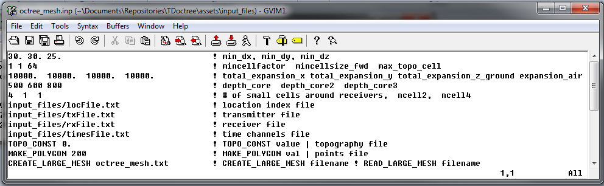

.. _tdoctree_input_octree:

Create OcTree Mesh Input File
=============================

:ref:`OcTree meshes<octreeFile>` used in the TDoctree code are created using the program **create_octree_td_tiled.exe**. This includes a global mesh (the mesh for which the inverse problem is solved) and a set of local meshes (OcTree meshes use to solve the set of forward problems). Parameters necessary for creating all of the OcTree meshes are set in the input file. The lines within the input file are as follows:

.. tabularcolumns:: |C|C|C|

+--------+-------------------------------------------------------------------------------------------+-----------------------------------------------------------------+
| Line # | Parameter                                                                                 | Descriptions                                                    |
+========+===========================================================================================+=================================================================+
| 1      |:ref:`dx dy dz<tdoctree_input_octreeln1>`                                                  | min. cell widths in x, y and z for base mesh                    |
+--------+-------------------------------------------------------------------------------------------+-----------------------------------------------------------------+
| 2      |:ref:`min_cell_fact min_cell_size_fwd max_topo_cell fwdmesh_dist<tdoctree_input_octreeln2>`| additional cell size parameters                                 |
+--------+-------------------------------------------------------------------------------------------+-----------------------------------------------------------------+
| 3      |:ref:`x_pad y_pad down_pad up_pad<tdoctree_input_octreeln3>`                               | sets the total mesh extent in x, y, down and up directions      |
+--------+-------------------------------------------------------------------------------------------+-----------------------------------------------------------------+
| 4      |:ref:`dist_inv_1 dist_inv_2 dist_inv_3<tdoctree_input_octreeln4>`                          | sets core mesh discretization for inversion                     |
+--------+-------------------------------------------------------------------------------------------+-----------------------------------------------------------------+
| 5      |:ref:`dist_fwd_1 dist_fwd_2 dist_fwd_3<tdoctree_input_octreeln5>`                          | sets core mesh discretization for forward modeling              |
+--------+-------------------------------------------------------------------------------------------+-----------------------------------------------------------------+
| 6      |:ref:`n1 n2 n3<tdoctree_input_octreeln6>`                                                  | sets thickness of cells of finest discretization near receivers |
+--------+-------------------------------------------------------------------------------------------+-----------------------------------------------------------------+
| 7      |:ref:`locFile<tdoctree_input_octreeln7>`                                                   | the file containing transmitters and observation locations      |
+--------+-------------------------------------------------------------------------------------------+-----------------------------------------------------------------+
| 8      |:ref:`topoFile<tdoctree_input_octreeln8>`                                                  | sets topography                                                 |
+--------+-------------------------------------------------------------------------------------------+-----------------------------------------------------------------+
| 9      |:ref:`polygon options<tdoctree_input_octreeln9>`                                           | sets lateral extent of core region                              |
+--------+-------------------------------------------------------------------------------------------+-----------------------------------------------------------------+
| 10     |:ref:`read/create mesh<tdoctree_input_octreeln10>`                                         | read in or create global inversion mesh                         |
+--------+-------------------------------------------------------------------------------------------+-----------------------------------------------------------------+

     Example input file for creating octree mesh (`Download <https://github.com/ubcgif/tdoctree/raw/tdoctree_tiled/assets/input_files/octree_mesh.inp>`__ )

Line Descriptions
^^^^^^^^^^^^^^^^^

.. _tdoctree_input_octreeln1:

    - **dx dy dz:** Minimum cell widths in x, y and z for the base mesh.

.. _tdoctree_input_octreeln2:

	- **min_cell_fact min_cell_size_fwd max_topo_cell fwdmesh_dist:** These parameters determine the rate of cell expansion for regions near topography and for the local forward meshes.

		- **min_cell_fact:** Defines the rate of topography-based cell size increase on the global inversion mesh with respect to depth. After each layer of N cells, the cell size will increase by a factor of 2 until a maximum cell size (max_topo_cell) is reached. N must be an integer value that is a power of 2.
		
		- **min_cell_size_fwd:** This sets the minimum cell size for the local forward meshes. A value of 2 means the minimum cell size in the local mesh has a side width of 2 times the base mesh cell size. This parameter must be an integer value that is a power of 2.
		
		- **max_topo_cell:** This determines the maximum cell size for which topography-based cell size increase is used on the global inversion mesh; after which typical OcTree cell expansion is used. This parameter must be an integer value that is a power of 2.
		
		- **meshfwd_dist:**

.. _tdoctree_input_octreeln3:

    - **x_pad y_pad down_pad up_pad:** Distance from the survey area in the x, y, downward and upward directions, respectively, that the mesh extends.

.. _tdoctree_input_octreeln4:

    - **dist_inv_1 dist_inv_2 dist_inv_3:** For the global inversion mesh, these parameters set the discretization of the core mesh region (i.e. the region near the transmitters and receivers) in terms of depth. Up to a depth of *dist_inv_1* from the surface, the smallest cell size is used (set by *dx, dy, dz*). For the following *dist_inv_2* metres, a cell width 2 times large is used. For the following *dist_inv_3 metres*, the cell width is doubled again. Below the third depth region, the cells widths increase by a factor of 2 for every additional layer (see the figure below).

.. _tdoctree_input_octreeln5:

    - **dist_fwd_1 dist_fwd_2 dist_fwd_3:** For the local forward meshes, these parameters set the discretization of the core mesh region (i.e. the region near the transmitter and receivers) in terms of depth. Up to a depth of *dist_fwd_1* from the surface, the smallest cell size is used (set by *dx, dy, dz*). For the following *dist_fwd_2* metres, a cell width 2 times large is used. For the following *dist_fwd_3* metres, the cell width is doubled again. Below the third depth region, the cells widths increase by a factor of 2 for every additional layer (see the figure below).

.. _tdoctree_input_octreeln6:

    - **n1 n2 n3:** This sets the thicknesses of layers of finest discretization near the receivers. **n1 = 4** means that around each receiver, there is a layer 4 cells thick that uses the finest discretization. This is followed by a layer which is **n2** cells thick, where the cell dimensions are increased by a factor of 2. Likewise for the 3rd layer.

.. _tdoctree_input_octreeln7:

    - **locFile:** Contains the locations of the receivers. The user may either enter the file path to an :ref:`observed data<obsFile>` file, or the flag "ONLY_LOC" followed by the path to a :ref:`data points<surveyFile>` file. 

.. _tdoctree_input_octreeln8:

    - **topoFile:** If a topography file is available, the file path to the topography file is entered; see :ref:`topography file<topoFile>` for format. In the case of flat topography, the user instead enter "TOPO_CONST", followed by a space, then the elevation of the surface topography; for example "TOPO_CONST 125.5".

.. _tdoctree_input_octreeln9:

    - **polygon options:** This sets the lateral extent of the core mesh region. Here, there are two options

        1. The flag *MAKE_POLYGON* is entered followed by a positive value (*val*). Up to a lateral distance *val* from all transmitters, the finest mesh discretization is used.
        2. Enter the file path to a :ref:`polygon file<topoFile>`. The polygon denotes the points of a convex hull that is used to define the lateral extent of the core mesh region.

.. _tdoctree_input_octreeln10:

	- **read/create mesh:** If the global inversion mesh has already been created, then it may be loaded by typing “READ_LARGE_MESH filepath”. In this case, the global inversion mesh is used to define the local forward meshes. If the global inversion mesh needs to be created, the user types “CREATE_LARGE_MESH *filename*”, where the global inversion mesh is output to the file *filename*.

